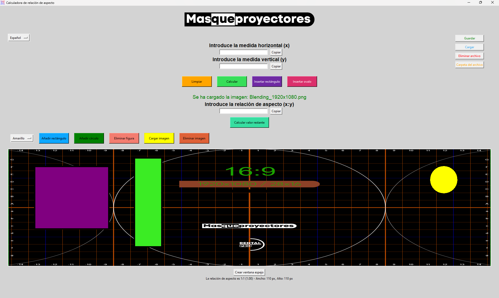

# MQP_Project
Proyecto hecho con **Tkinter** para [**MasQueProyectores**](https://masqueproyectores.com) que sirve como **calculadora de relaciones de aspecto**. También incluye un **canvas** para poder crear figuras personalizadas junto con una variedad de funcionalidades extra que resultan muy cómodas y útiles para el usuario. Pruébala ya aquí:

[Descarga las últimas versiones aquí](https://github.com/Aniol0012/MQP_Project/releases)

## Previsualización
**V9.5**


## Instrucciones para crear el ejecutable

Para crear el ejecutable de este programa para sistemas Windows se puede usar la herramienta ya incluida en los ficheros del proyecto llamada [build.sh](https://github.com/Aniol0012/MQP_Project/blob/main/build.sh).

**Uso:**
```
./build.sh [-s] <versión>
```

Con la ejecución de este script se creará una carpeta llamada executables en donde estaran todas las versiones ejecutadas.

## Instrucciones de ejecución manual

1. **Abrir una terminal (powershell, cmd, bash...) y copiar el repositorio:**
    ```sh 
    git clone https://github.com/Aniol0012/MQP_Project.git
    ```
    o descargar manualmente el fichero.

2. **Instalar dependencias:**
   ```
   pip install tkinter
   ```
   ```
   pip install pillow
   ```

3. **Dentro del directorio ejecutar la aplicación:**
   ```sh
   python3 main.py
   ```

