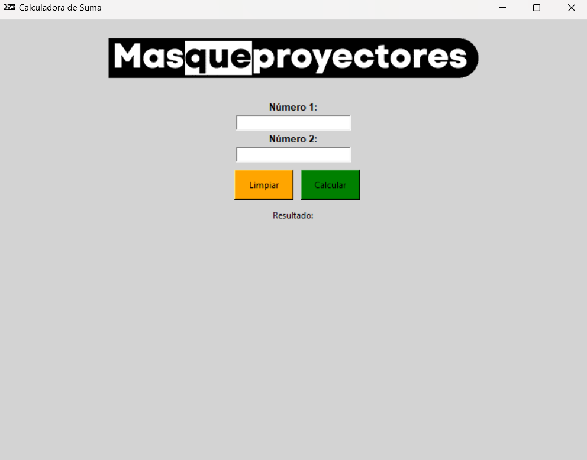

# MQP_Project
Proyecto hecho con Tkinter para MasQueProyectores

## Instruciones

1. **Abrir una terminal (powershell, cmd, bash...) y copiar el repositorio:**
    ```sh 
    git clone https://github.com/Aniol0012/MQP_Project
    ```
    o descargar manualmente el fichero.
   
2. **Dentro de la carpeta ejecutar la aplicacion:**
   ```sh
   python3 main.py
   ```

## Previsualización
**Pendiente de actualizar!!!**
