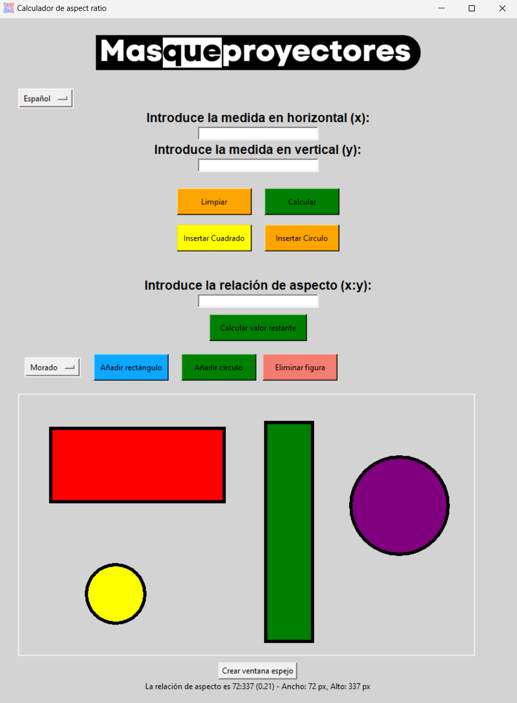

# MQP_Project
Proyecto hecho con Tkinter para MasQueProyectores

## Instrucciones

1. **Abrir una terminal (powershell, cmd, bash...) y copiar el repositorio:**
    ```sh 
    git clone https://github.com/Aniol0012/MQP_Project
    ```
    o descargar manualmente el fichero.

2. **Instalar dependencias:**
   ```
   pip install tkinter
   ```
   ```
   pip install pillow
   ```

3. **Dentro del directorio ejecutar la aplicación:**
   ```sh
   python3 main.py
   ```

## TECLAS

Para mover las figuras, usa las siguientes teclas:

- `W` Para mover hacia arriba
- `A` Para mover hacia la izquierda
- `S` Para mover hacia abajo
- `D` Para mover hacia la derecha
- `R` Para agrandar
- `F` Para encoger


## Previsualización
**V8**
